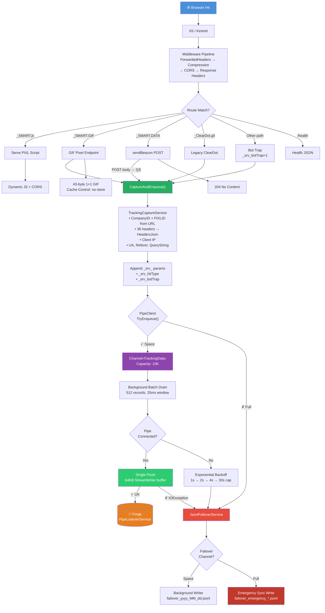

# PiXL Edge — Request Pipeline

```mermaid
flowchart TD
    Browser["🌐 Browser Hit"] --> IIS["IIS / Kestrel"]
    IIS --> MW["Middleware Pipeline\nForwardedHeaders → Compression\n→ CORS → Response Headers"]

    MW --> Route{"Route Match?"}
    Route -->|"_SMART.js"| JS["Serve PiXL Script"]
    Route -->|"_SMART.GIF"| GIF["GIF Pixel Endpoint"]
    Route -->|"_SMART.DATA"| DATA["sendBeacon POST"]
    Route -->|"_ClearDot.gif"| LEGACY["Legacy ClearDot"]
    Route -->|"Other path"| TRAP["Bot Trap\n_srv_botTrap=1"]
    Route -->|"/health"| HEALTH["Health JSON"]

    GIF --> CAP["CaptureAndEnqueue()"]
    DATA -->|"POST body → QS"| CAP
    LEGACY --> CAP
    TRAP --> CAP

    CAP --> PARSE["TrackingCaptureService\n• CompanyID + PiXLID from URL\n• 36 headers → HeadersJson\n• Client IP\n• UA, Referer, QueryString"]

    PARSE --> SRV["Append _srv_ params\n• _srv_hitType\n• _srv_botTrap"]

    SRV --> PIPE{"PipeClient\nTryEnqueue()"}
    PIPE -->|"✓ Space"| CHAN["Channel‹TrackingData›\nCapacity: 10K"]
    PIPE -->|"✗ Full"| FAIL["JsonlFailoverService"]

    CHAN --> BATCH["Background Batch Drain\n512 records, 25ms window"]
    BATCH --> CONN{"Pipe\nConnected?"}

    CONN -->|"Yes"| FLUSH["Single Flush\n64KB StreamWriter buffer"]
    CONN -->|"No"| BACK["Exponential Backoff\n1s → 2s → 4s → 30s cap"]
    BACK --> FAIL

    FLUSH -->|"✓ OK"| FORGE[("🔧 Forge\nPipeListenerService")]
    FLUSH -->|"✗ IOException"| FAIL

    FAIL --> FCH{"Failover\nChannel?"}
    FCH -->|"Space"| FWRITE["Background Writer\nfailover_yyyy_MM_dd.jsonl"]
    FCH -->|"Full"| EMERG["Emergency Sync Write\nfailover_emergency_*.jsonl"]

    GIF --> RES["43-byte 1×1 GIF\nCache-Control: no-store"]
    DATA --> RES204["204 No Content"]
    JS --> RESJS["Dynamic JS + CORS"]

    style Browser fill:#4a90d9,color:#fff
    style FORGE fill:#e67e22,color:#fff
    style FAIL fill:#e74c3c,color:#fff
    style EMERG fill:#c0392b,color:#fff
    style CAP fill:#27ae60,color:#fff
    style CHAN fill:#8e44ad,color:#fff
    style FLUSH fill:#2ecc71,color:#fff
```
