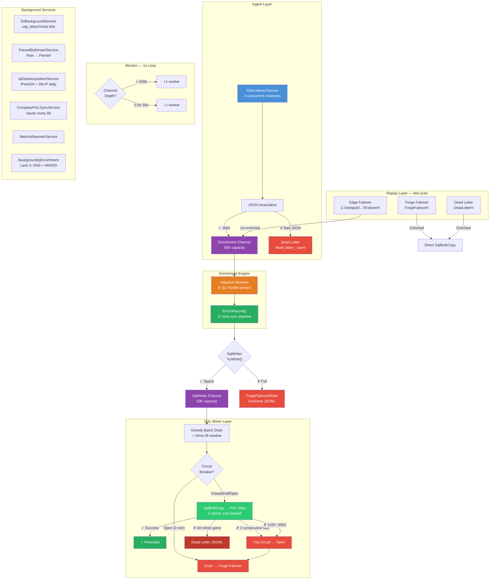

# SmartPiXL Forge — Complete Pipeline

```mermaid
flowchart TD
    subgraph INGEST["Ingest Layer"]
        PIPE["PipeListenerService\n4 concurrent instances"]
        PIPE --> DESER["JSON Deserialize"]
        DESER -->|"✓ Valid"| ECH
        DESER -->|"✗ Bad JSON"| DL["Dead Letter\ndead_letter_*.jsonl"]
    end

    ECH["Enrichment Channel\n50K capacity"]

    subgraph REPLAY["Replay Layer — 60s scan"]
        EFAIL["Edge Failover\nC:\\inetpub\\...\\Failover\\"]
        FFAIL["Forge Failover\nForgeFailover\\"]
        DLDIR["Dead Letter\nDeadLetter\\"]
    end

    EFAIL -->|"Un-enriched"| ECH
    FFAIL -->|"Enriched"| SQLDIRECT["Direct SqlBulkCopy"]
    DLDIR -->|"Enriched"| SQLDIRECT

    subgraph ENGINE["Enrichment Engine"]
        WORKERS["Adaptive Workers\n8–32, NUMA-pinned"]
        ENRICH["EnrichRecord()\n17-step sync pipeline"]
        WORKERS --> ENRICH
    end

    ECH --> WORKERS

    ENRICH --> WRTRY{"SqlWriter\nTryWrite()"}
    WRTRY -->|"✓ Space"| SCH["SqlWriter Channel\n50K capacity"]
    WRTRY -->|"✗ Full"| FWRITE["ForgeFailoverWriter\nEnriched JSONL"]

    subgraph SCALE["Monitor — 1s Loop"]
        MON{"Channel\nDepth?"}
        MON -->|"> 1000"| UP["+1 worker"]
        MON -->|"0 for 30s"| DOWN["−1 worker"]
    end

    subgraph SQLW["SQL Writer Layer"]
        DRAIN["Greedy Batch Drain\n+ 50ms fill window"]
        CB{"Circuit\nBreaker?"}
        BULK["SqlBulkCopy → PiXL.Raw\n3 retries, exp backoff"]
        DRFAIL["Drain → Forge Failover"]
        OK["✓ Persisted"]
        TRIP["Trip Circuit → Open"]
        DLDISK["Dead Letter JSONL"]
    end

    SCH --> DRAIN
    DRAIN --> CB
    CB -->|"Closed/HalfOpen"| BULK
    CB -->|"Open (2-min)"| DRFAIL
    BULK -->|"✓ Success"| OK
    BULK -->|"✗ 2 consecutive fails"| TRIP
    BULK -->|"✗ 1105 / 9002"| TRIP
    BULK -->|"✗ All retries gone"| DLDISK
    TRIP --> DRFAIL

    subgraph BG["Background Services"]
        ETL["EtlBackgroundService\nusp_MatchVisits 60s"]
        PARSED["ParsedBulkInsertService\nRaw → Parsed"]
        IPDATA["IpDataAcquisitionService\nIPtoASN + DB-IP daily"]
        COMPANY["CompanyPiXLSyncService\nXavier every 6h"]
        METRICS["MetricsReporterService"]
        BGIP["BackgroundIpEnrichment\nLane 3: DNS + WHOIS"]
    end

    style PIPE fill:#4a90d9,color:#fff
    style ECH fill:#8e44ad,color:#fff
    style SCH fill:#8e44ad,color:#fff
    style WORKERS fill:#e67e22,color:#fff
    style ENRICH fill:#27ae60,color:#fff
    style BULK fill:#2ecc71,color:#fff
    style OK fill:#27ae60,color:#fff
    style TRIP fill:#e74c3c,color:#fff
    style DL fill:#e74c3c,color:#fff
    style FWRITE fill:#e74c3c,color:#fff
    style DRFAIL fill:#e74c3c,color:#fff
    style DLDISK fill:#c0392b,color:#fff
```
