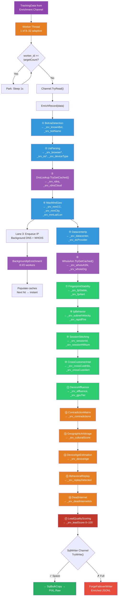

# Enrichment Engine — 17-Step Pipeline

```mermaid
flowchart TD
    IN["TrackingData from\nEnrichment Channel"] --> WORKER["Worker Thread\n1 of 8–32 adaptive"]

    WORKER --> PARK{"worker_id >=\ntargetCount?"}
    PARK -->|"Yes"| SLEEP["Park: Sleep 1s"]
    SLEEP --> PARK
    PARK -->|"No"| READ["Channel.TryRead()"]
    READ --> ENRICH["EnrichRecord(data)"]

    ENRICH --> E1["① BotUaDetection\n→ _srv_knownBot, _srv_botName"]
    E1 --> E2["② UaParsing\n→ _srv_browser*, _srv_os*, _srv_deviceType"]
    E2 --> E3["③ DnsLookup.TryGetCached()\n→ _srv_rdns, _srv_rdnsCloud"]
    E3 --> E4["④ MaxMindGeo\n→ _srv_mmCC, _srv_mmCity, _srv_mmLat/Lon"]
    E4 --> E5["⑤ DatacenterIp\n→ _srv_datacenter, _srv_dcProvider"]
    E5 --> E6["⑥ WhoisAsn.TryGetCached()\n→ _srv_whoisASN, _srv_whoisOrg"]

    E4 --> L3["Lane 3: Enqueue IP\nBackground DNS + WHOIS"]
    L3 --> BGIP["BackgroundIpEnrichment\n8 I/O workers"]
    BGIP --> CACHE["Populate caches\nNext hit → instant"]

    E6 --> E7["⑦ FingerprintStability\n→ _srv_fpStable, _srv_fpAlert"]
    E7 --> E8["⑧ IpBehavior\n→ _srv_subnetVelocity, _srv_rapidFire"]
    E8 --> E9["⑨ SessionStitching\n→ _srv_sessionId, _srv_sessionHitNum"]
    E9 --> E10["⑩ CrossCustomerIntel\n→ _srv_crossCustHits, _srv_crossCustAlert"]
    E10 --> E11["⑪ DeviceAffluence\n→ _srv_affluence, _srv_gpuTier"]

    E11 --> E12["⑫ ContradictionMatrix\n→ _srv_contradictions"]
    E12 --> E13["⑬ GeographicArbitrage\n→ _srv_culturalScore"]
    E13 --> E14["⑭ DeviceAgeEstimation\n→ _srv_deviceAge"]
    E14 --> E15["⑮ BehavioralReplay\n→ _srv_replayDetected"]
    E15 --> E16["⑯ DeadInternet\n→ _srv_deadInternetIdx"]

    E16 --> E17["⑰ LeadQualityScoring\n→ _srv_leadScore 0–100"]

    E17 --> OUT{"SqlWriter Channel\nTryWrite()"}
    OUT -->|"✓ Space"| SQL["→ SqlBulkCopy → PiXL.Raw"]
    OUT -->|"✗ Full"| FFAIL["ForgeFailoverWriter\nEnriched JSONL"]

    style IN fill:#8e44ad,color:#fff
    style WORKER fill:#e67e22,color:#fff
    style E1 fill:#3498db,color:#fff
    style E2 fill:#3498db,color:#fff
    style E3 fill:#9b59b6,color:#fff
    style E4 fill:#3498db,color:#fff
    style E5 fill:#3498db,color:#fff
    style E6 fill:#9b59b6,color:#fff
    style E7 fill:#2ecc71,color:#fff
    style E8 fill:#2ecc71,color:#fff
    style E9 fill:#2ecc71,color:#fff
    style E10 fill:#2ecc71,color:#fff
    style E11 fill:#2ecc71,color:#fff
    style E12 fill:#e67e22,color:#fff
    style E13 fill:#e67e22,color:#fff
    style E14 fill:#e67e22,color:#fff
    style E15 fill:#e67e22,color:#fff
    style E16 fill:#e67e22,color:#fff
    style E17 fill:#c0392b,color:#fff
    style SQL fill:#27ae60,color:#fff
    style FFAIL fill:#e74c3c,color:#fff
    style BGIP fill:#9b59b6,color:#fff
```
