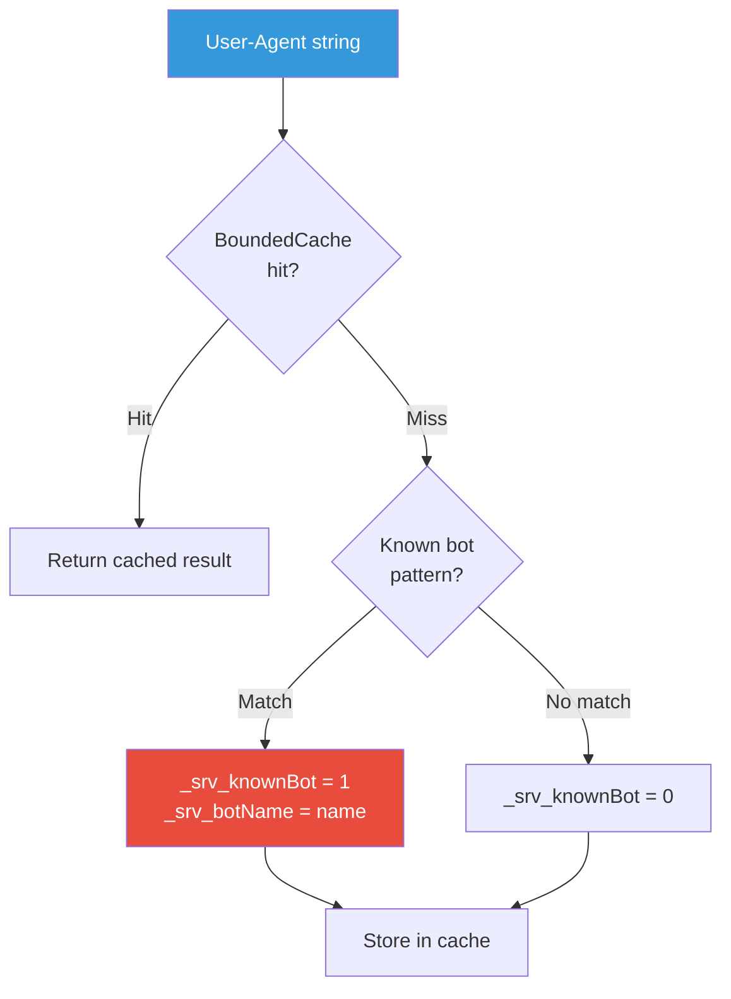
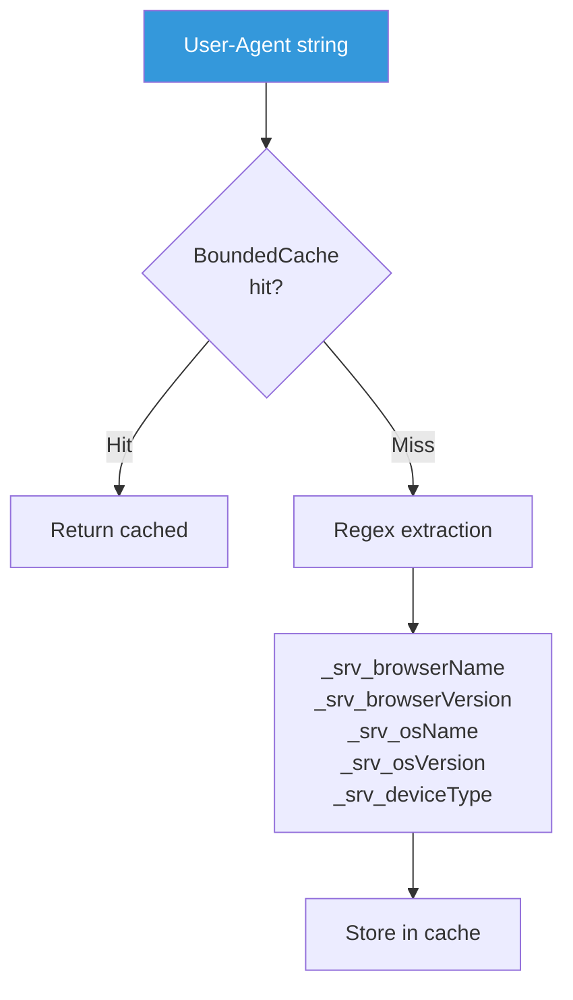
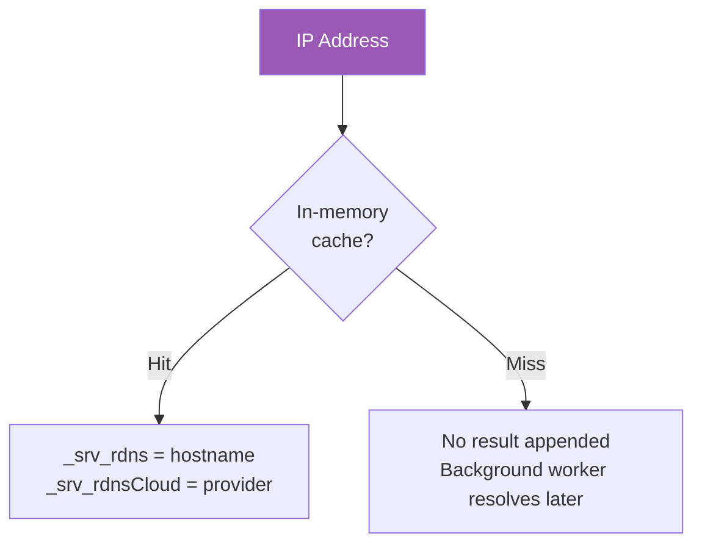
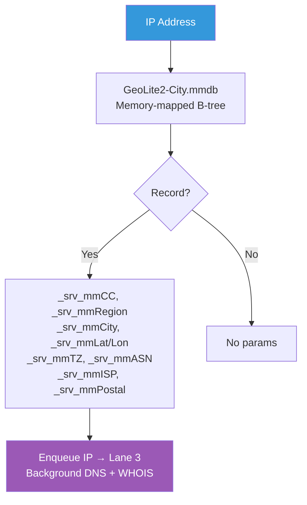
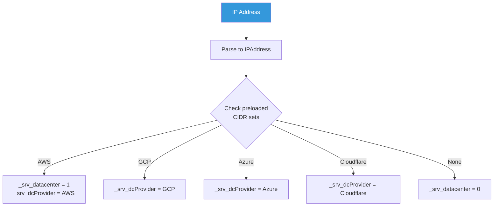
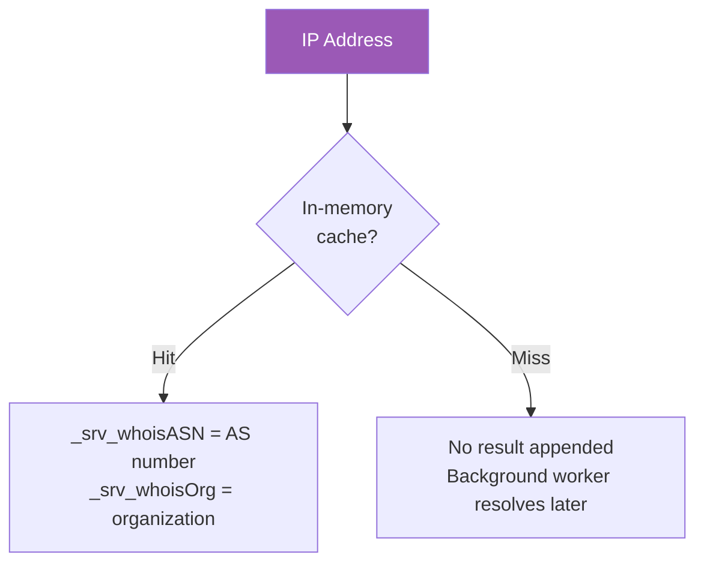

# Tier 1 — Fast Detection (Steps ①–⑥)

## ① BotUaDetection

```mermaid
flowchart TD
    IN["User-Agent string"] --> CACHE{"BoundedCache\nhit?"}
    CACHE -->|"Hit"| RET["Return cached result"]
    CACHE -->|"Miss"| CHECK{"Known bot\npattern?"}
    CHECK -->|"Match"| BOT["_srv_knownBot = 1\n_srv_botName = name"]
    CHECK -->|"No match"| HUMAN["_srv_knownBot = 0"]
    BOT --> STORE["Store in cache"]
    HUMAN --> STORE

    style IN fill:#3498db,color:#fff
    style BOT fill:#e74c3c,color:#fff
```

## ② UaParsing

```mermaid
flowchart TD
    IN["User-Agent string"] --> CACHE{"BoundedCache\nhit?"}
    CACHE -->|"Hit"| RET["Return cached"]
    CACHE -->|"Miss"| PARSE["Regex extraction"]
    PARSE --> OUT["_srv_browserName\n_srv_browserVersion\n_srv_osName\n_srv_osVersion\n_srv_deviceType"]
    OUT --> STORE["Store in cache"]

    style IN fill:#3498db,color:#fff
```

## ③ DnsLookup (Lane 3 cache read)

```mermaid
flowchart TD
    IN["IP Address"] --> CACHE{"In-memory\ncache?"}
    CACHE -->|"Hit"| RET["_srv_rdns = hostname\n_srv_rdnsCloud = provider"]
    CACHE -->|"Miss"| SKIP["No result appended\nBackground worker resolves later"]

    style IN fill:#9b59b6,color:#fff
```

## ④ MaxMindGeo

```mermaid
flowchart TD
    IN["IP Address"] --> MMDB["GeoLite2-City.mmdb\nMemory-mapped B-tree"]
    MMDB --> FOUND{"Record?"}
    FOUND -->|"Yes"| OUT["_srv_mmCC, _srv_mmRegion\n_srv_mmCity, _srv_mmLat/Lon\n_srv_mmTZ, _srv_mmASN\n_srv_mmISP, _srv_mmPostal"]
    FOUND -->|"No"| NONE["No params"]
    OUT --> ENQ["Enqueue IP → Lane 3\nBackground DNS + WHOIS"]

    style IN fill:#3498db,color:#fff
    style ENQ fill:#9b59b6,color:#fff
```

## ⑤ DatacenterIp

```mermaid
flowchart TD
    IN["IP Address"] --> PARSE["Parse to IPAddress"]
    PARSE --> CHECK{"Check preloaded\nCIDR sets"}
    CHECK -->|"AWS"| AWS["_srv_datacenter = 1\n_srv_dcProvider = AWS"]
    CHECK -->|"GCP"| GCP["_srv_dcProvider = GCP"]
    CHECK -->|"Azure"| AZ["_srv_dcProvider = Azure"]
    CHECK -->|"Cloudflare"| CF["_srv_dcProvider = Cloudflare"]
    CHECK -->|"None"| NO["_srv_datacenter = 0"]

    style IN fill:#3498db,color:#fff
```

## ⑥ WhoisAsn (Lane 3 cache read)

```mermaid
flowchart TD
    IN["IP Address"] --> CACHE{"In-memory\ncache?"}
    CACHE -->|"Hit"| RET["_srv_whoisASN = AS number\n_srv_whoisOrg = organization"]
    CACHE -->|"Miss"| SKIP["No result appended\nBackground worker resolves later"]

    style IN fill:#9b59b6,color:#fff
```
