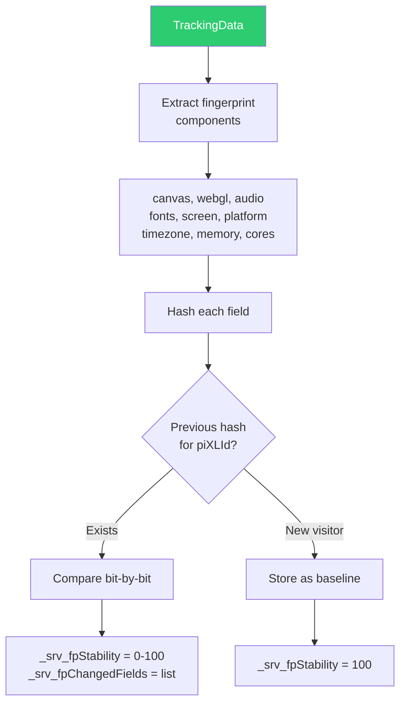
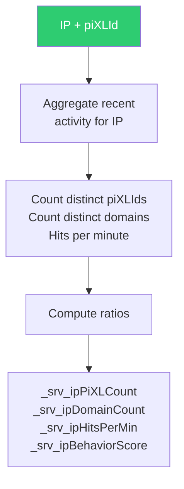
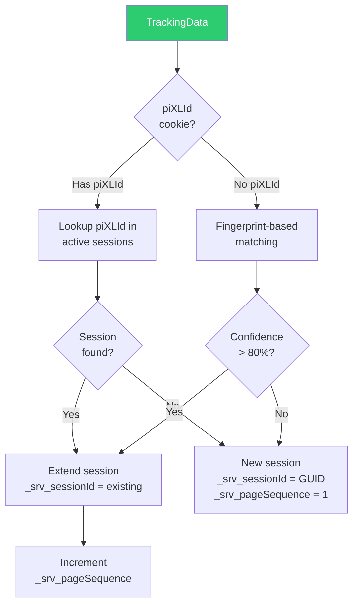
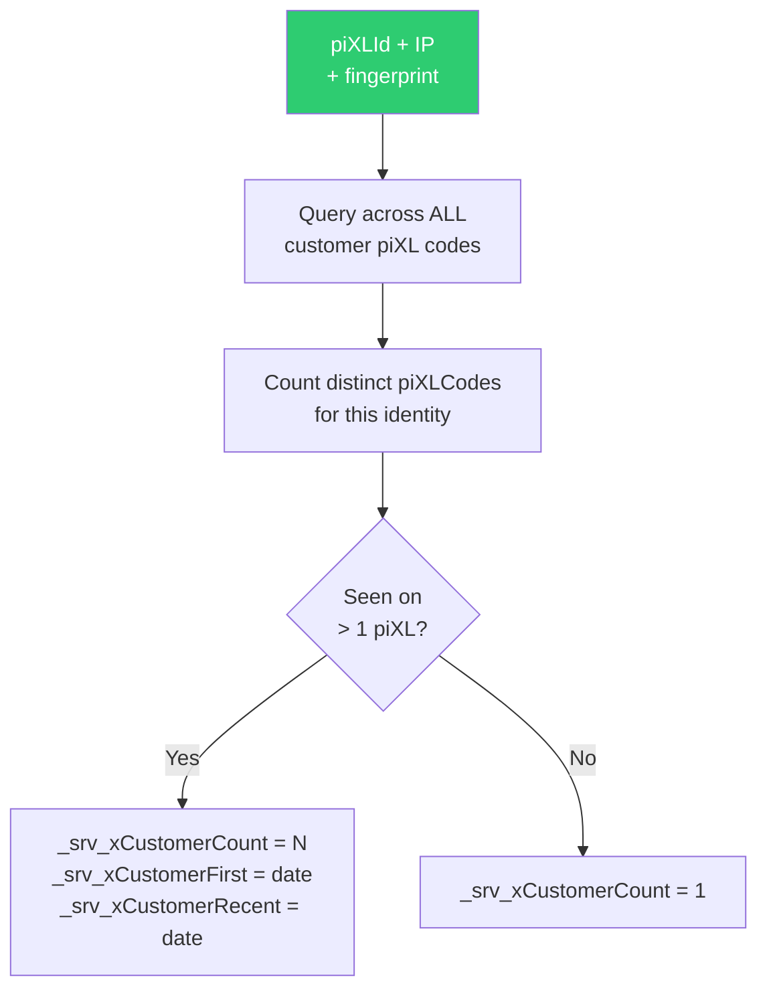
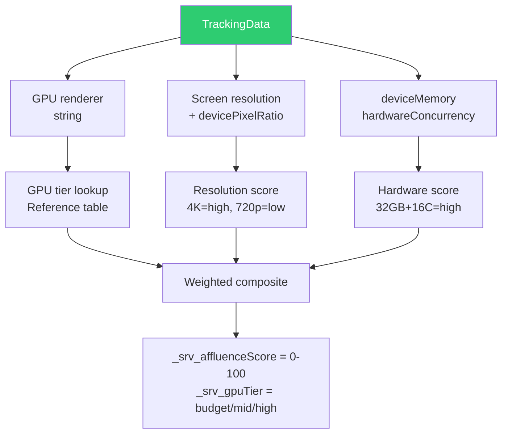

# Tier 2 — Behavioral Analysis (Steps ⑦–⑪)

## ⑦ FingerprintStability

```mermaid
flowchart TD
    IN["TrackingData"] --> EXTRACT["Extract fingerprint\ncomponents"]
    EXTRACT --> FIELDS["canvas, webgl, audio\nfonts, screen, platform\ntimezone, memory, cores"]
    FIELDS --> HASH["Hash each field"]
    HASH --> LOOK{"Previous hash\nfor piXLId?"}
    LOOK -->|"Exists"| COMP["Compare bit-by-bit"]
    LOOK -->|"New visitor"| STORE["Store as baseline"]
    COMP --> SCORE["_srv_fpStability = 0-100\n_srv_fpChangedFields = list"]
    STORE --> BASELINE["_srv_fpStability = 100"]

    style IN fill:#2ecc71,color:#fff
```

## ⑧ IpBehavior

```mermaid
flowchart TD
    IN["IP + piXLId"] --> AGG["Aggregate recent\nactivity for IP"]
    AGG --> CALC["Count distinct piXLIds\nCount distinct domains\nHits per minute"]
    CALC --> RATIOS["Compute ratios"]
    RATIOS --> OUT["_srv_ipPiXLCount\n_srv_ipDomainCount\n_srv_ipHitsPerMin\n_srv_ipBehaviorScore"]

    style IN fill:#2ecc71,color:#fff
```

## ⑨ SessionStitching

```mermaid
flowchart TD
    IN["TrackingData"] --> CHECK{"piXLId\ncookie?"}
    CHECK -->|"Has piXLId"| MATCH["Lookup piXLId in\nactive sessions"]
    CHECK -->|"No piXLId"| FP["Fingerprint-based\nmatching"]
    MATCH --> FOUND{"Session\nfound?"}
    FOUND -->|"Yes"| EXTEND["Extend session\n_srv_sessionId = existing"]
    FOUND -->|"No"| NEW["New session\n_srv_sessionId = GUID\n_srv_pageSequence = 1"]
    FP --> PROB{"Confidence\n> 80%?"}
    PROB -->|"Yes"| EXTEND
    PROB -->|"No"| NEW
    EXTEND --> SEQ["Increment\n_srv_pageSequence"]

    style IN fill:#2ecc71,color:#fff
```

## ⑩ CrossCustomerIntel

```mermaid
flowchart TD
    IN["piXLId + IP\n+ fingerprint"] --> SCAN["Query across ALL\ncustomer piXL codes"]
    SCAN --> COUNT["Count distinct piXLCodes\nfor this identity"]
    COUNT --> MULTI{"Seen on\n> 1 piXL?"}
    MULTI -->|"Yes"| FLAG["_srv_xCustomerCount = N\n_srv_xCustomerFirst = date\n_srv_xCustomerRecent = date"]
    MULTI -->|"No"| SINGLE["_srv_xCustomerCount = 1"]

    style IN fill:#2ecc71,color:#fff
```

## ⑪ DeviceAffluence

```mermaid
flowchart TD
    IN["TrackingData"] --> GPU["GPU renderer\nstring"]
    IN --> SCR["Screen resolution\n+ devicePixelRatio"]
    IN --> MEM["deviceMemory\nhardwareConcurrency"]
    GPU --> TIER["GPU tier lookup\nReference table"]
    SCR --> RES["Resolution score\n4K=high, 720p=low"]
    MEM --> HW["Hardware score\n32GB+16C=high"]
    TIER --> AGG["Weighted composite"]
    RES --> AGG
    HW --> AGG
    AGG --> OUT["_srv_affluenceScore = 0-100\n_srv_gpuTier = budget/mid/high"]

    style IN fill:#2ecc71,color:#fff
```
