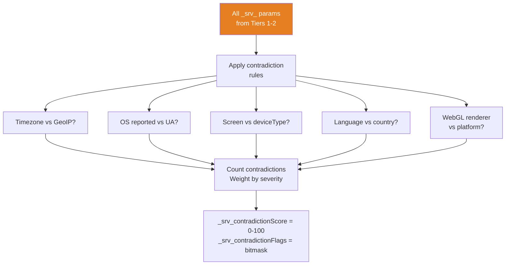
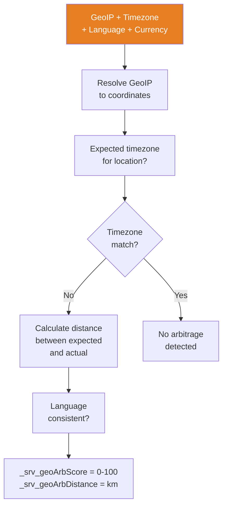
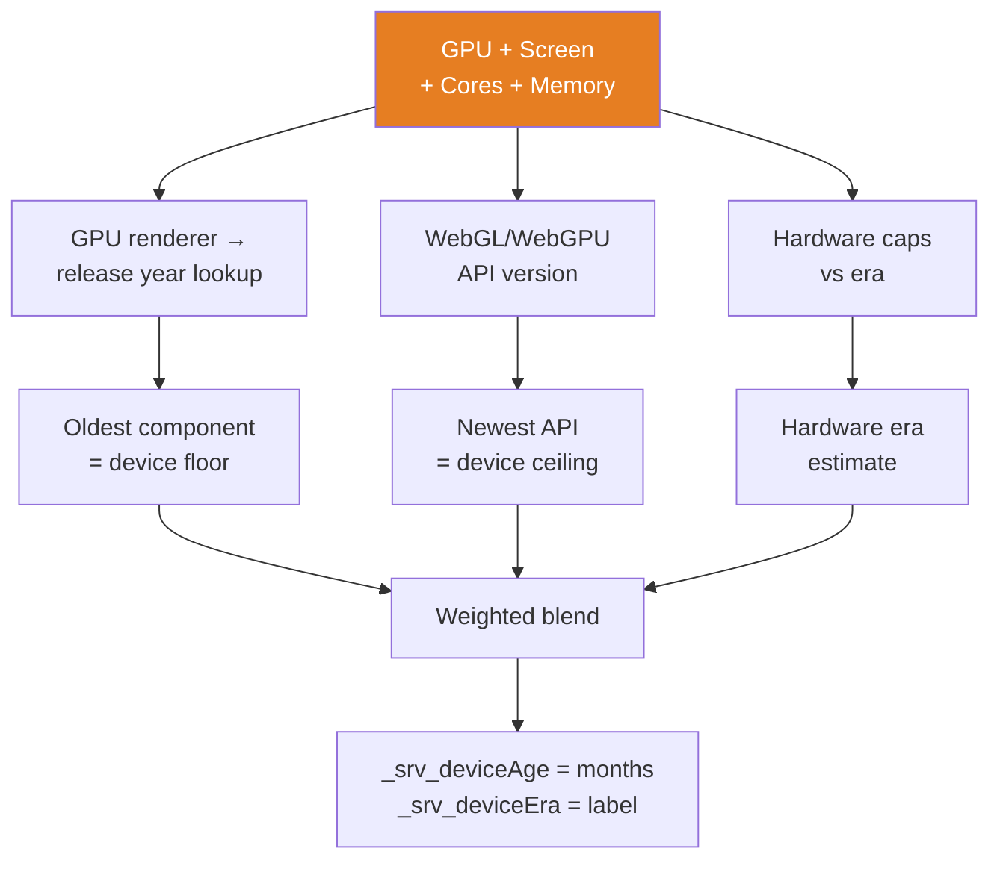
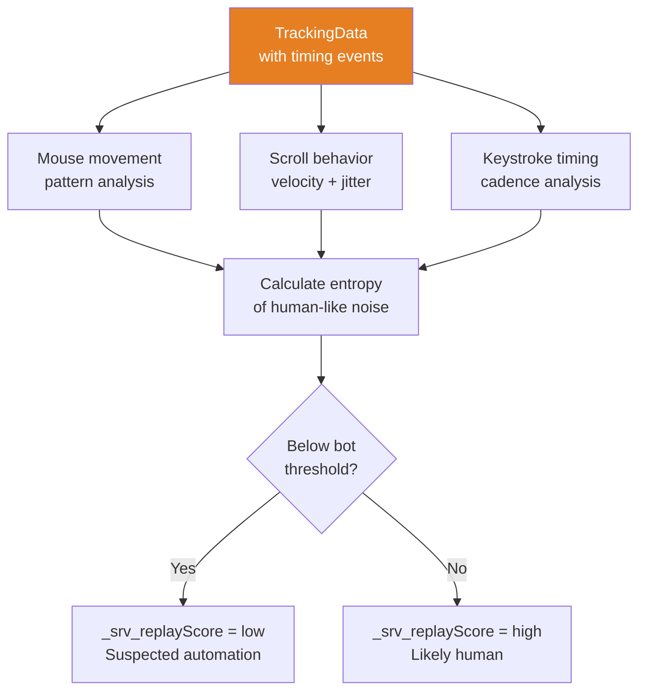
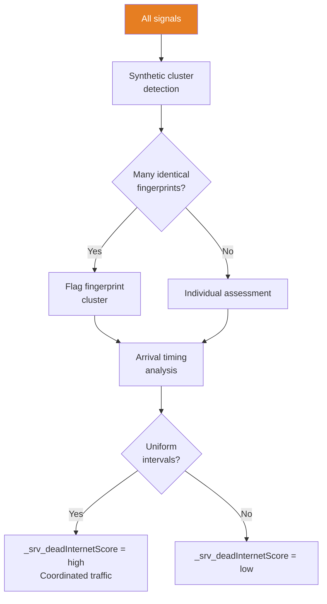
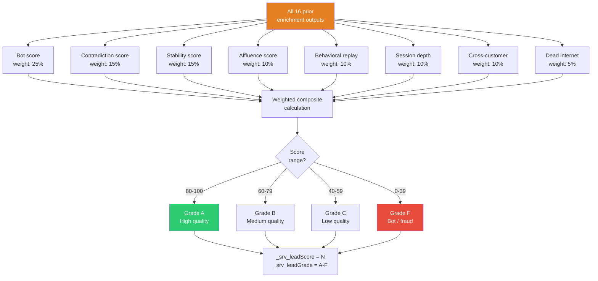

# Tier 3 — Scoring & Synthesis (Steps ⑫–⑰)

## ⑫ ContradictionMatrix

## ⑬ GeographicArbitrage

## ⑭ DeviceAgeEstimation

## ⑮ BehavioralReplay

## ⑯ DeadInternet

## ⑰ LeadQualityScoring (Final)

